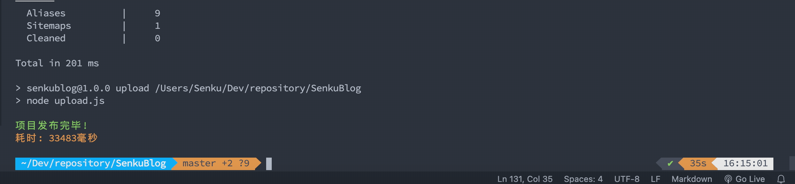

## 起因
说起来你可能不信，在2020年中的某一天，手残党将自己的博客源文件删除，导致原来在`nocoding.xyz`中的博客无法更新

于是，时隔大半个世纪才有了本站的产生，偶然间在看别人的博客过程中找到了这个由[Hugo](https://gohugo.io/)构建的博客主题，嗯... 是心动的感觉💓

## 经过

### 开始折腾

#### 1、搭建服务
1. 根据官方文档快速上手：[QuickStart](https://gohugo.io/getting-started/quick-start/)
2. 本博客采用的主题：[Stack](https://github.com/hfge/hugo-theme-stack)
3. 主题的配置及使用指南：[参考文档](https://docs.stack.jimmycai.com/v/zh-cn/configuration)
### 2、遇到的问题

#### 2.1 什么是Open Graph标签
在主题的配置文件中有一行 `opengraph`, 并不了解这是做什么的

> Open Graph Protocol（开放图谱协议），简称 OG 协议或 OGP。它是 Facebook 在 2010 年 F8 开发者大会公布的一种网页元信息（Meta Information）标记协议，属于 Meta Tag （Meta 标签）的范畴，是一种为社交分享而生的 Meta 标签。

根据以上内容可以断定，是为了优化SEO，并且是针对社交平台的优化。
带有OG标签的内容分享后的效果也比不带的好 **会展示缩略图** 。


#### 2.2 什么是Front-Matter
```md
---
title: tags
date: 2019-08-13 09:39:50
type: tags
layout: tag
---
```
Front-Matter就是.md文件最上面的这部分内容,具体介绍参考这部分内容：[front-matter使用详解](https://blog.csdn.net/weixin_42252518/article/details/99550466)

#### 2.3 如何查看访问量
本博客使用了[不蒜子网页计数器](http://busuanzi.ibruce.info/)，可查看文档解锁更多打开方式。

**食用方式**
1. 在`theme\{{your_theme}}\layouts\partials\article\components`文件夹下找到`footer.html`文件
2. 插入以下代码便可达到与本博客一致的样式
    ```html
    <section class="article-views">
        {{ partial "helper/icon" "views" }}
    <span id="busuanzi_value_page_pv"></span><span>&nbsp;&nbsp;views</span>
    </section>
    <script async src="//busuanzi.ibruce.info/busuanzi/2.3/busuanzi.pure.mini.js"></script>
    ```
    备注：`article-views`类属性需要你在`assets\img`文件下有一个名为`views.svg`的图片文件

#### 2.4 MarkDown中写HTML标签不生效
目前已知的问题：在本博客原生的MarkDown文件中编写HTML标签会被忽略

~~这在常见的MarkDown语法中并不符合正常逻辑，猜测是模版引擎转译时忽略了~~

问了一下大佬，才发现Hugo官方手册有提及关于MarkDown渲染的配置，[具体文档](https://gohugo.io/getting-started/configuration-markup#readout)

在`config.yaml`中加入以下内容即可，你也可以根据文档配置其他内容
```yaml
markup:
    goldmark:
        renderer:
            unsafe: true
```


#### 2.5 如何开启RSS
博客默认自带RSS地址，如果你有使用`RSSHub Radar`这个谷歌插件，那么当你进入博客就可以看到订阅地址。

#### 2.6 如何开启评论系统
0. 该博客主题自带**disqus**和**remark42**的支持,具体可以查看各自官方文档
1. 具体可以参考[这篇博客](https://www.lihaowen.com/free-time/how-to-bulid-remark42)
2. 我卡在了Nginx的反向代理配置上很久...
### 打包部署

#### 打包
输入命令`hugo -D`即可构建写好的文章打包

#### 搭建部署
因为每个人的部署方式各有不同，有的人直接丢服务器，有的人直接上GitHub Pages

##### 搭建

0. 域名:
   如果你也想拥有 **.app域名**，购买来自于[namesilo](http://www.namesilo.com/?rid=e87cb67hy),在该站购买域名可以使用优惠码`senkuaff`获得`1$`的折扣
1. 服务器: 我选择的是**谷歌云**，这边看个人的喜好，国外的服务器和域名能够**免备案**。
2. Web服务器我选择的是**Nginx**，依旧看个人喜好 :b)

##### 部署
这部分内容我将讲述如何将写好的内容自动化部署到服务器上

0. 首先你需要安装`Node`>12.16.0版本
1. 在本项目下使用`npm init`初始化项目
2. 输入命令`npm i ora dotenv scp2`安装所需要的依赖
3. 在根目录下创建`.env`文件
    文件内容如下:
    ```
    SERVER_HOST=YOUR_SERVER
    SERVER_USERNAME=root
    SERVER_PORT=22
    SERVER_PASSWORD=YOUR_PASSWORD
    SERVER_PATH=/var/www/html
    ```
    ⚠️注意:用户、端口、路径根据你的实际情况进行改动
4. 在根目录下创建`upload.js`文件
    ```js
    'use strict'
    require('dotenv').config()
    // 引入scp2
    var client = require('scp2')
    // 下面三个插件是部署的时候控制台美化所用 可有可无
    const ora = require('ora')
    const chalk = require('chalk')
    const spinner = ora(chalk.green('正在发布到服务器...'))
    spinner.start()
    const startTime = new Date()
    client.scp('./public/', {    // 本地打包文件的位置
    "host": process.env.SERVER_HOST, // 服务器的IP地址
    "port": process.env.SERVER_PORT,            // 服务器端口， 一般为 22
    "username": process.env.SERVER_USERNAME,       // 用户名
    "password": process.env.SERVER_PASSWORD,     // 密码
    "path": process.env.SERVER_PATH            // 项目部署的服务器目标位置
    }, err =>{
    spinner.stop()
    if (!err) {
        const endTime = new Date()
        console.log(chalk.green("项目发布完毕!"))
        console.log(chalk.yellow(`耗时: ${endTime - startTime}毫秒`))
    } else {
        console.log("err", err)
    }
    })
    ```
5. 在根目录下的`package.json`文件中，加入`build`,`upload`,`deploy`即可使用`npm run deploy`自动打包部署
    ```json
    {
      "scripts": {
        "test": "echo \"Error: no test specified\" && exit 1",
        "build": "hugo -D",
        "upload": "node upload.js",
        "deploy": "npm run build && npm run upload"
      }
    }
    ```
    演示:
    

## 未完待续...

