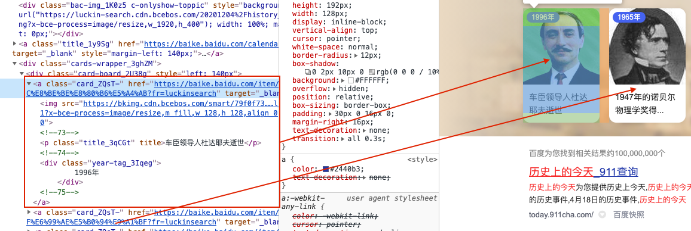

## 起因

从Scriptable讨论群了解到历史上的今日接口有一点问题，于是主动提出通过爬虫给[2ya](https://t.me/DmYaYa)写个新的接口，于是便有了以下的故事。

## 经过

### 作案工具

1. Chrome

不打开网页你怎么爬？爬个寂寞的🐛。其次，百度历史上的今天没有对应的接口，需要根据DOM进行元素的分析定位

2. [request](https://github.com/request/request)模块

Node下进行网络请求的一个模块

3. [cheerio](https://cheerio.js.org/)

cheerio是jquery核心功能的一个快速灵活而又简洁的实现，主要是为了用在服务器端需要对DOM进行操作的地方

4. eggjs

使用Eggjs框架编写Node下的接口，并且利用其定时任务的特性，每天爬取一次来更新数据，防止频繁请求封禁IP。Eggjs的官方地址为：[Eggjs](https://eggjs.org/zh-cn/intro/quickstart.html)

### 开始作案

##### 打开Chrome，使用百度搜索关键字`历史上的今天`


初步分析可以看出由一组卡片组成，每个卡片的样式是一致的，并且主要由年份、图片、标题、具体链接四部分组成，那么先把我们需要的数据结构定义一下：

```ts
type historyItem = {
  href: string|null
  img: string|null
  title: string
  year: string
}
```


##### 对卡片进行元素分析，`F12`启动(糟糕，19款MBP Touch Bar鸡肋)



1. 分析观察，可以看到每张卡片都由`<a>`标签和其子元素组成，并且`<a>`标签的类名都为`card_ZQsT-`，标签上的`href`属性是每张卡片相对应的链接地址，标题和年份也都乖乖的呆在属于自己的位置。
2. 提取数据的思路：根据`<a>`标签的类名`card_ZQsT_`找到所有的卡片元素 ---> 逐一提取每个卡片元素的`href`属性、子元素`p`标签且类名为`title_3qCGt`的内容、子元素`div`标签且类名为`year-tag-3Iqeg`的内容。

##### 开始编码

1. 发起GET请求页面

```ts
const opts = {
  // 搜索历史上的今天得到的url
  url: 'https://www.baidu.com/s?wd=%E5%8E%86%E5%8F%B2%E4%B8%8A%E7%9A%84%E4%BB%8A%E5%A4%A9',
  header: {
    'User-Agent': 'Mozilla/5.0 (Windows NT 6.1; Win64; x64) AppleWebKit/537.36 (KHTML, like Gecko) Chrome/76.0.3809.132 Safari/537.36'
  }
}

request(opts, (err, resp, body) => {
  const html = body // 得到网页的字符串内容
})
```

2. 使用cheerio解析页面便于对返回的数据进行DOM操作

```ts
const $ = cheerio.load(body)
```

3. 定位所有的`<a>`标签元素，逐个解析内部子元素提取到我们想要的数据

```ts
const arr: Array<historyItem> = []
$('.card_ZQsT-').each((_, ele) => { // 通过类名 .card_ZQsT- 取到所有卡片元素，each方法对每个元素进行循环操作
  const card = $(ele) // 这一步对卡片字符串继续解析成为DOM，此时的card可以看成就是整个 a 标签和其子元素
  const href = card.attr('href') // 获取到卡片的链接
  const img = card.children('img').attr('src') // 获取到图片地址
  const title = card.children('p').text() // 获取到标题名称
  const year = card.children('.year-tag_3Iqeg').text().trim() // 获取到年份并去掉多余的空格换行
  arr.push({
    href: href ? href : null,
    img: img ? img : null,
    title,
    year,
  })
})
```


#### 最终的结果

```ts
import { Service } from 'egg'
// eslint-disable-next-line @typescript-eslint/no-var-requires
import request = require('request')
import cheerio = require('cheerio')
import { historyItem } from '../types/index'
/**
   * Crawler Service
 */
export default class Crawler extends Service {
  public async grapTodayInHistory() {
    return new Promise(resolve => {
      const opts = {
        url: 'https://www.baidu.com/s?wd=%E5%8E%86%E5%8F%B2%E4%B8%8A%E7%9A%84%E4%BB%8A%E5%A4%A9',
        headers: { 'User-Agent': 'Mozilla/5.0 (Windows NT 6.1; Win64; x64) AppleWebKit/537.36 (KHTML, like Gecko) Chrome/76.0.3809.132 Safari/537.36' },
      }
      const arr: Array<historyItem> = []
      request(opts, (_err, _resp, body) => {
        const $ = cheerio.load(body)
        $('.card_ZQsT-').each((_, ele) => {
          const card = $(ele)
          const href = card.attr('href')
          const img = card.children('img').attr('src')
          const title = card.children('p').text()
          const year = card.children('.year-tag_3Iqeg').text().trim()
          arr.push({
            href: href ? href : null,
            img: img ? img : null,
            title,
            year,
          })
        })
        resolve(arr)
      })
    })
  }
	// 将数据写入数据库
  public async setHistoryToDb() {
    const historyList = await this.grapTodayInHistory()
    await new this.ctx.model.Crawler({ historyList }).save()
  }
	// 从数据库获取数据
  public async getHistoryFromDb() {
    return this.ctx.model.Crawler.findOne({}, { _id: 0, historyList: 1 }).sort({ _id: -1 })
  }
}
```

### 作案结束

关于接口的部分，本文不做过多展开，因为涉及到很多Node下的内容以及后端的一系列知识。

如果你也想实现自己爬取的话，你需要阅读[`request`](https://github.com/request/request)、[`cheerio`](https://cheerio.js.org/)的官方文档，并且拥有一定的DOM操作元素的知识，`cheerio`的使用可以先了解一下[`jQuery`](https://www.runoob.com/jquery/jquery-tutorial.html)进行基本的入门。

## 尾声

接口地址暂时不在博客公开，如果你有需要，可以通过[@Senku](https://t.me/gideon_senku)联系我。